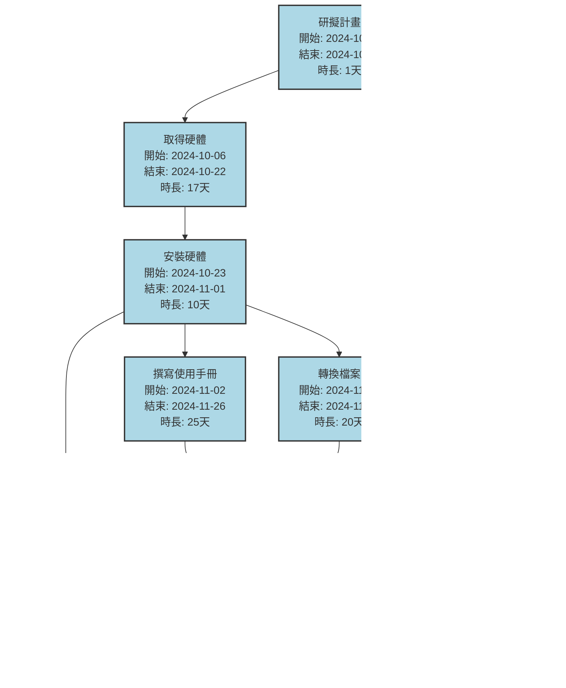
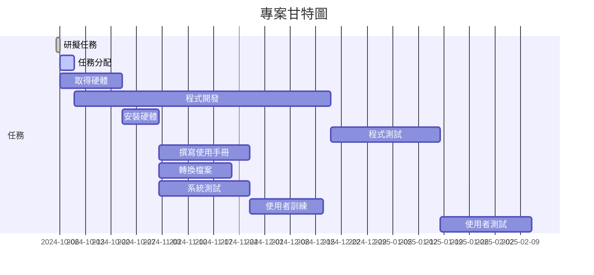
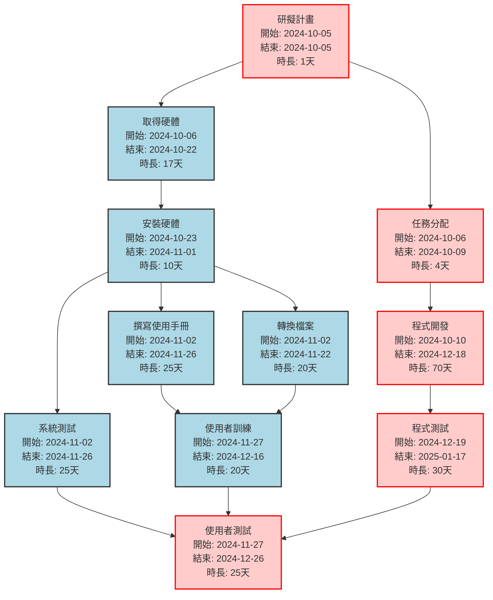

```mermaid
graph TD;
    A[研擬計畫<br>開始: 2024-10-05<br>結束: 2024-10-05<br>時長: 1天] --> B[任務分配<br>開始: 2024-10-06<br>結束: 2024-10-09<br>時長: 4天];
    A --> C[取得硬體<br>開始: 2024-10-06<br>結束: 2024-10-22<br>時長: 17天];
    B --> D[程式開發<br>開始: 2024-10-10<br>結束: 2024-12-18<br>時長: 70天];
    C --> E[安裝硬體<br>開始: 2024-10-23<br>結束: 2024-11-01<br>時長: 10天];
    D --> F[程式測試<br>開始: 2024-12-19<br>結束: 2025-01-17<br>時長: 30天];
    E --> G[撰寫使用手冊<br>開始: 2024-11-02<br>結束: 2024-11-26<br>時長: 25天];
    E --> H[轉換檔案<br>開始: 2024-11-02<br>結束: 2024-11-22<br>時長: 20天];
    E --> I[系統測試<br>開始: 2024-11-02<br>結束: 2024-11-26<br>時長: 25天];
    G --> J[使用者訓練<br>開始: 2024-11-27<br>結束: 2024-12-16<br>時長: 20天];
    H --> J;
    I --> K[使用者測試<br>開始: 2024-11-27<br>結束: 2024-12-26<br>時長: 25天];
    J --> K;
    F --> K;

    classDef default fill:#add8e6,stroke:#333,stroke-width:2px;
    classDef keyTask fill:#ffcccb,stroke:#ff0000,stroke-width:2px;
```


```mermaid
gantt
    title 專案甘特圖
    dateFormat  YYYY-MM-DD
    section 任務
    研擬任務      :done,    des1, 2024-10-05, 1d
    任務分配      :active,  des2, after des1, 4d
    取得硬體      :         des3, after des1, 17d
    程式開發      :         des4, after des2, 70d
    安裝硬體      :         des5, after des3, 10d
    程式測試      :         des6, after des4, 30d
    撰寫使用手冊  :         des7, after des5, 25d
    轉換檔案      :         des8, after des5, 20d
    系統測試      :         des9, after des5, 25d
    使用者訓練    :         des10, after des7 des8, 20d
    使用者測試    :         des11, after des6 des9 des10, 25d

```


```mermaid
graph TD;
    A[研擬計畫<br>開始: 2024-10-05<br>結束: 2024-10-05<br>時長: 1天] --> B[任務分配<br>開始: 2024-10-06<br>結束: 2024-10-09<br>時長: 4天];
    A --> C[取得硬體<br>開始: 2024-10-06<br>結束: 2024-10-22<br>時長: 17天];
    B --> D[程式開發<br>開始: 2024-10-10<br>結束: 2024-12-18<br>時長: 70天];
    C --> E[安裝硬體<br>開始: 2024-10-23<br>結束: 2024-11-01<br>時長: 10天];
    D --> F[程式測試<br>開始: 2024-12-19<br>結束: 2025-01-17<br>時長: 30天];
    E --> G[撰寫使用手冊<br>開始: 2024-11-02<br>結束: 2024-11-26<br>時長: 25天];
    E --> H[轉換檔案<br>開始: 2024-11-02<br>結束: 2024-11-22<br>時長: 20天];
    E --> I[系統測試<br>開始: 2024-11-02<br>結束: 2024-11-26<br>時長: 25天];
    G --> J[使用者訓練<br>開始: 2024-11-27<br>結束: 2024-12-16<br>時長: 20天];
    H --> J;
    I --> K[使用者測試<br>開始: 2024-11-27<br>結束: 2024-12-26<br>時長: 25天];
    J --> K;
    F --> K;

    classDef default fill:#add8e6,stroke:#333,stroke-width:2px;
    classDef keyTask fill:#ffcccb,stroke:#ff0000,stroke-width:2px;

    class A,B,D,F,K keyTask;


```
```mermaid
