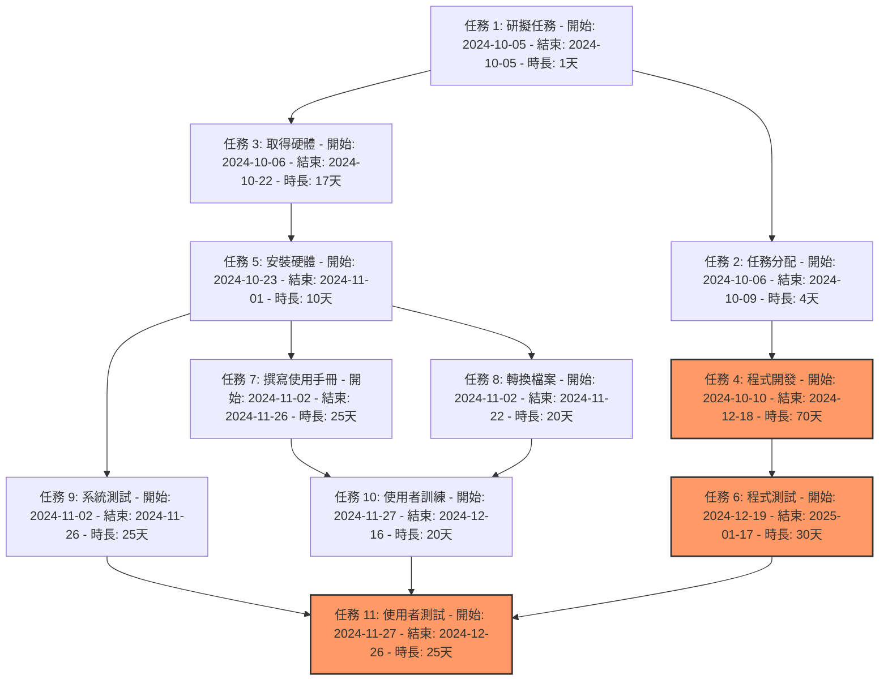
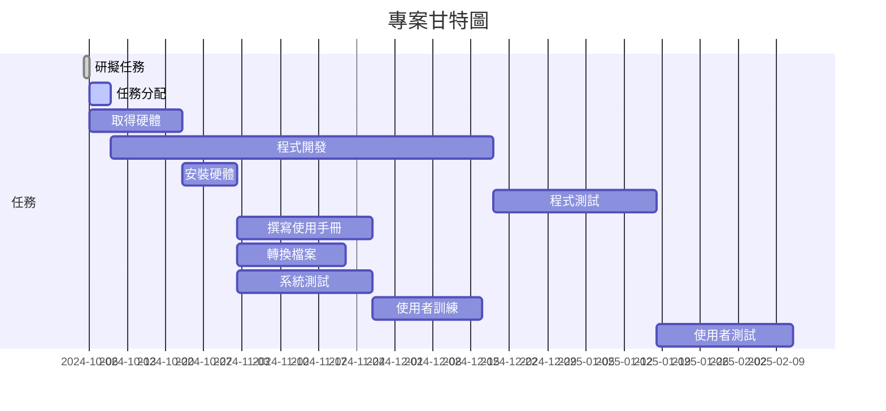

```mermaid
graph TD;
    A[任務 1: 研擬任務 - 開始: 2024-10-05 - 結束: 2024-10-05 - 時長: 1天] --> B[任務 2: 任務分配 - 開始: 2024-10-06 - 結束: 2024-10-09 - 時長: 4天];
    A --> C[任務 3: 取得硬體 - 開始: 2024-10-06 - 結束: 2024-10-22 - 時長: 17天];
    B --> D[任務 4: 程式開發 - 開始: 2024-10-10 - 結束: 2024-12-18 - 時長: 70天];
    C --> E[任務 5: 安裝硬體 - 開始: 2024-10-23 - 結束: 2024-11-01 - 時長: 10天];
    D --> F[任務 6: 程式測試 - 開始: 2024-12-19 - 結束: 2025-01-17 - 時長: 30天];
    E --> G[任務 7: 撰寫使用手冊 - 開始: 2024-11-02 - 結束: 2024-11-26 - 時長: 25天];
    E --> H[任務 8: 轉換檔案 - 開始: 2024-11-02 - 結束: 2024-11-22 - 時長: 20天];
    E --> I[任務 9: 系統測試 - 開始: 2024-11-02 - 結束: 2024-11-26 - 時長: 25天];
    G --> J[任務 10: 使用者訓練 - 開始: 2024-11-27 - 結束: 2024-12-16 - 時長: 20天];
    H --> J;
    I --> K[任務 11: 使用者測試 - 開始: 2024-11-27 - 結束: 2024-12-26 - 時長: 25天];
    J --> K;
    F --> K;

    class D,F,K red;

    classDef red fill:#f96,stroke:#333,stroke-width:2px;
```

```mermaid
gantt
    title 專案甘特圖
    dateFormat  YYYY-MM-DD
    section 任務
    研擬任務      :done,    des1, 2024-10-05, 1d
    任務分配      :active,  des2, after des1, 4d
    取得硬體      :         des3, after des1, 17d
    程式開發      :         des4, after des2, 70d
    安裝硬體      :         des5, after des3, 10d
    程式測試      :         des6, after des4, 30d
    撰寫使用手冊  :         des7, after des5, 25d
    轉換檔案      :         des8, after des5, 20d
    系統測試      :         des9, after des5, 25d
    使用者訓練    :         des10, after des7 des8, 20d
    使用者測試    :         des11, after des6 des9 des10, 25d

```

```mermaid
graph TD;
    A[任務 1: 研擬任務 - 開始: 2024-10-05 - 結束: 2024-10-05 - 時長: 1天] --> B[任務 2: 任務分配 - 開始: 2024-10-06 - 結束: 2024-10-09 - 時長: 4天];
    A --> C[任務 3: 取得硬體 - 開始: 2024-10-06 - 結束: 2024-10-22 - 時長: 17天];
    B --> D[任務 4: 程式開發 - 開始: 2024-10-10 - 結束: 2024-12-18 - 時長: 70天];
    C --> E[任務 5: 安裝硬體 - 開始: 2024-10-23 - 結束: 2024-11-01 - 時長: 10天];
    D --> F[任務 6: 程式測試 - 開始: 2024-12-19 - 結束: 2025-01-17 - 時長: 30天];
    E --> G[任務 7: 撰寫使用手冊 - 開始: 2024-11-02 - 結束: 2024-11-26 - 時長: 25天];
    E --> H[任務 8: 轉換檔案 - 開始: 2024-11-02 - 結束: 2024-11-22 - 時長: 20天];
    E --> I[任務 9: 系統測試 - 開始: 2024-11-02 - 結束: 2024-11-26 - 時長: 25天];
    G --> J[任務 10: 使用者訓練 - 開始: 2024-11-27 - 結束: 2024-12-16 - 時長: 20天];
    H --> J;
    I --> K[任務 11: 使用者測試 - 開始: 2024-11-27 - 結束: 2024-12-26 - 時長: 25天];
    J --> K;
    F --> K;

    class D,F,K red;

    classDef red fill:#f96,stroke:#333,stroke-width:2px;


```

